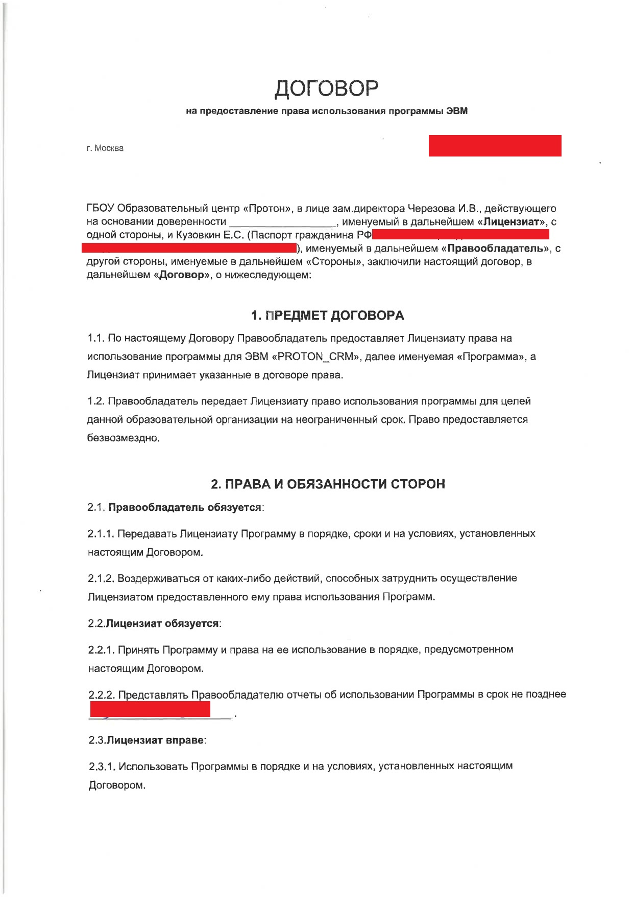
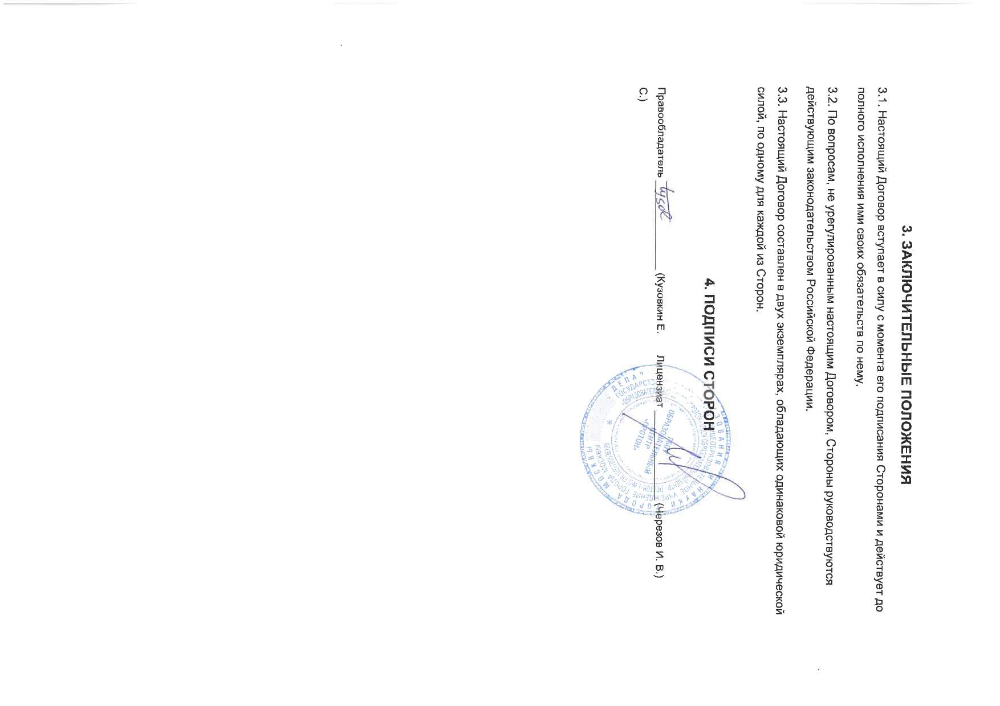

# Репозиторий CRM системы [«Образовательного центра Протон»](https://proton.mskobr.ru/)

## Разработан [prok0l](https://github.com/prok0l), по тз администрации ОЦ

---
 схема базы данных

---
### Cтарт проекта:
- создание .env файла
    ```dotenv
    SECRET_KEY=
    TOKEN=
    ADMIN_IDS=
    USE_REDIS=False
    REMIND_TIME=60
    BOT_LINK=
    ```
- создание миграций
    ```shell
      python3 protoncrm/manage.py makemigrations
      python3 protoncrm/manage.py migrate
    ```
- запуск проекта
    ```shell
    docker-compose up
    ```

---
[](docs/img/contract1.jpg)
[](docs/img/contract2.jpg)

---
[Презентация проекта](docs/presentation.pptx)\
[Пояснительная записка](docs/proton_crm.docx)

---
### License

[(The MIT License)](LICENSE.txt)